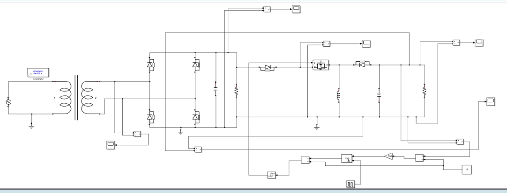
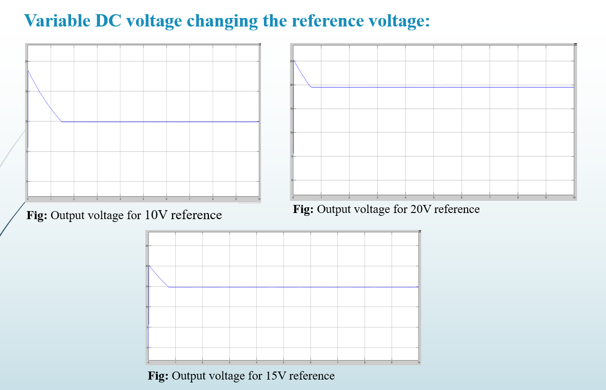

# Laboratory-Variable-DC-Power-Supply

This project presents the design and simulation of a **Laboratory Variable DC Power Supply** with closed-loop feedback control. The system converts **220V AC mains voltage into a regulated, adjustable DC output**, maintaining a constant output voltage despite load variations.

The project was developed as part of the **EEE 316 – Power Electronics Laboratory** at the **Bangladesh University of Engineering and Technology (BUET)**.

---

## 📌 Project Objectives

* Step down **220V AC** to a lower AC voltage
* Convert AC voltage to DC using rectification and filtering
* Design a **buck–boost DC–DC converter**
* Implement **feedback control** to regulate output voltage
* Maintain stable DC output under varying load conditions
* Enable **variable DC output** by adjusting reference voltage

---

## 🧩 System Block Diagram

**Main Functional Blocks:**

* AC Source (220V RMS)
* Step-down Transformer
* Full-Bridge Rectifier with RC Filter
* Buck–Boost Converter
* Error Voltage Measurement
* Feedback Controller
* Reference Voltage Source

---

## ⚙️ System Description

### ✔ Step-down Transformer Block

* Input: 220V RMS AC (311V peak)
* Transformer Rating: **220V / 30V RMS**
* Output Peak Voltage: **42.4V**
* Purpose: Reduce mains voltage to a safe operating level

---

### ✔ Rectifier Block

* Full-wave bridge rectifier
* RC filter used to suppress high-frequency ripple
* Rectified DC Output Voltage: **≈ 40.8V**
* Converts AC to smooth DC for converter input

---

### ✔ Buck–Boost Converter Block

* Operates as:
  * **Buck converter** for duty cycle **D < 0.5**
  * **Boost converter** for duty cycle **D > 0.5**
* Output Voltage Equation: $ V_o = -\frac{D}{1-D} V_{in} $

* Achieved Output Voltage: **≈ −14.8V**

---

### ✔ Error Voltage Measurement

* Reference Voltage: **15V**
* Error Voltage ≈ **0.2V**
* Determines deviation between actual and desired output

---

### ✔ Feedback Controller

* Components:
  * Gain block
  * Integral controller
  * Relay
  * Feedback path
* Ensures:
  * Stable output voltage
  * Load-independent regulation

---

## 📊 Simulation Results

### Output Voltage Regulation (15V Reference)

* Load = **5kΩ** → Output ≈ 15V  
* Load = **220Ω** → Output ≈ 15V  

---

### Variable DC Output via Reference Voltage Control

* Reference = **10V**
* Reference = **15V**
* Reference = **20V**

The output voltage closely tracks the reference voltage, demonstrating effective closed-loop control.

---

## 🧪 Key Observations

* Stable DC output regardless of load variation
* Accurate reference tracking
* Effective ripple suppression
* Successful implementation of feedback-controlled buck–boost converter

---

## 🎯 Project Impact

This project provides hands-on understanding of:

* AC–DC conversion
* DC–DC power electronics
* Feedback and control systems
* Practical voltage regulation techniques

It closely resembles real-world **laboratory power supplies** used in electronics testing and education.

---

## Project Status

✅ Completed — Functional simulation verified  

🔧 Future Scope:
* Hardware implementation
* Improved efficiency
* Protection circuits (OVP, OCP)
* Digital controller integration

---

## Contributors

* **Joy Saha (1706189)**
* Ishtiaque Ahmed (1706190)
* Tasnim Rahman (1706191)
* Aong Shay Sing Marma (1706195)

Department of Electrical & Electronic Engineering  
Bangladesh University of Engineering and Technology (BUET)

---

## License

This project is for academic and educational purposes only.
